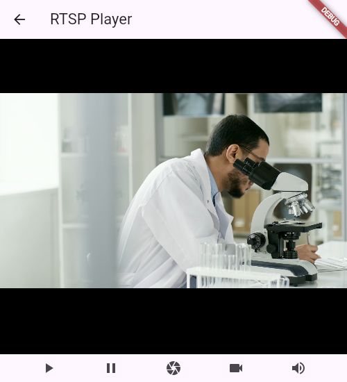

# flutter_rtsp_player

[](https://github.com/xmaihh/flutter_rtsp_player/releases)
[](https://github.com/xmaihh/flutter_rtsp_player/actions/)

A new Flutter project.

## Getting Started

This project is a starting point for a Flutter application.

A few resources to get you started if this is your first Flutter project:

- [Lab: Write your first Flutter app](https://docs.flutter.dev/get-started/codelab)
- [Cookbook: Useful Flutter samples](https://docs.flutter.dev/cookbook)

For help getting started with Flutter development, view the
[online documentation](https://docs.flutter.dev/), which offers tutorials,
samples, guidance on mobile development, and a full API reference.


```
my_rtsp_player/
├── android/
├── ios/
├── lib/
│   ├── main.dart
│   ├── screens/
│   │   ├── home_screen.dart
│   │   ├── player_screen.dart
│   │   └── add_rtsp_screen.dart
│   ├── models/
│   │   └── rtsp_stream.dart
│   ├── services/
│   │   ├── rtsp_service.dart
│   │   └── media_service.dart
│   ├── widgets/
│   │   ├── stream_list.dart
│   │   ├── stream_item.dart
│   │   └── player_controls.dart
│   └── utils/
│       ├── config_manager.dart
│       └── media_utils.dart
├── pubspec.yaml
└── README.md
```

Summary
- Android/iOS: ~~Uses [flutter_vlc_player](https://pub.dev/packages/flutter_vlc_player).~~ Uses [medit-kit](https://pub.dev/packages/media_kit).
- ~~Web: Uses [video_player](https://pub.dev/packages/video_player).~~  👉👉👉[[Stack Overflow]How to play RTSP streams in Flutter WEB.](https://stackoverflow.com/questions/69524526/how-to-play-rtsp-streams-in-flutter-web/70382420#70382420)
- Windows, macOS, Linux: ~~Uses [dart_vlc](https://pub.dev/packages/dart_vlc).~~ Uses [medit-kit](https://pub.dev/packages/media_kit).

|  |  |  |
|---------------------------------------------|-------------------------------------------|---------------------------------------------|

<details>

<summary> RTSP Test Server </summary>

Details for RTSP Test Server:  https://github.com/RSATom/rtsp-test-server

</details>

[](https://snapcraft.io/rtsp-test-server)

Available urls:

- rtsp://localhost:8554/bars
- rtsp://localhost:8554/white
- rtsp://localhost:8554/black
- rtsp://localhost:8554/red
- rtsp://localhost:8554/green
- rtsp://localhost:8554/blue
- rtsp://localhost:8554/bars-vp8
- rtsp://localhost:8554/white-vp8
- rtsp://localhost:8554/black-vp8
- rtsp://localhost:8554/red-vp8
- rtsp://localhost:8554/green-vp8
- rtsp://localhost:8554/blue-vp8